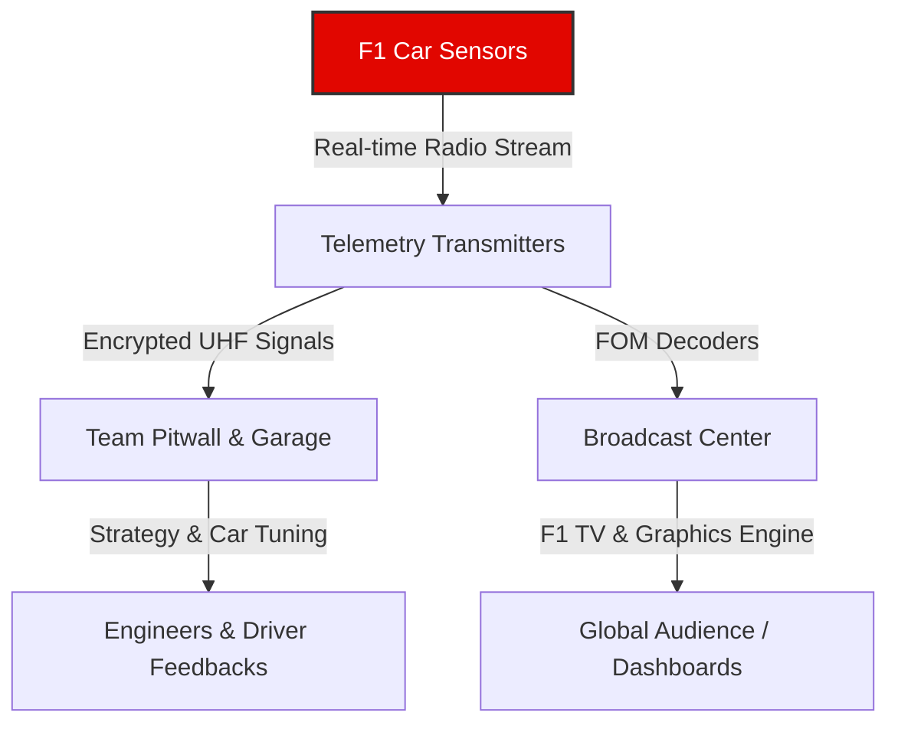

# Formula 1 Interactive Telemetry Dashboard: Project Report

This report outlines the technical and conceptual framework of the Formula 1 Interactive Telemetry Dashboard, explaining the significance of telemetry in modern motorsport, its impact on the fan viewing experience, and how this project implements these features in a customizable, interactive web application.

---

## 01. Understanding F1 Telemetry and its Role in the Sport

### What is F1 Telemetry?
Formula 1 is as much a data science competition as it is a physical sport. Every modern F1 car is equipped with **over 300 physical sensors** that collect and transmit data in real-time. This transmission of data from the moving car to the garage via radio waves is known as **telemetry**.

F1 telemetry encompasses a broad range of data points:
- **Driver Inputs**: Throttle application (0–100%), brake pressure (PSI/bar), steering angle, gear selection, and DRS (Drag Reduction System) activation status.
- **Car Dynamics**: Vehicle speed (km/h or mph), engine RPM, longitudinal and lateral G-forces, and ride height.
- **Component Health**: Tyre temperatures (inner, middle, outer carcass), tyre pressures, brake temperatures, engine coolant levels, battery state of charge (ERS harvesting/deployment), and structural load forces.



### Telemetry as a Part of Viewing the Sport
In the early days of racing, fans only saw cars passing by at select corners. Today, viewing telemetry has transitioned from a secretive engineering tool to a core component of how fans consume Formula 1:
- **Deconstruct Driver Skill**: Telemetry allows fans to see exactly *why* a driver like Lewis Hamilton or Max Verstappen is faster through a sequence of corners. By comparing throttle trace overlays, fans can observe throttle modulation, late-braking thresholds, and exit traction differences.
- **Predictive Strategy & Strategy Insight**: Observing tyre temperature degradation curves or ERS battery reserves allows viewers to predict when a driver will experience drop-off, when they are preparing for an "undercut" pitstop, or when they are charging their battery for an overtake.
- **Incident Analysis**: In the event of a crash, locking wheels, or mechanical failure, live telemetry immediately reveals whether there was a sudden drop in hydraulic pressure, an engine misfire, or if a driver carried too much speed or braked too late.

---

## 02. The Enhanced Fan Viewing Experience

Traditional sports broadcasts are linear and passive. The director decides what to show, often focusing on the mid-field battles or lead cars while neglecting the subtle strategic plays happening elsewhere. Telemetry and live data change this paradigm entirely.

| Passive Viewing (Standard Broadcast) | Augmented Viewing (Telemetry & Live Data) |
| :--- | :--- |
| **Linear Focus**: You only see the action on the current camera feed. | **Global Awareness**: You track the position, gap, and speed of all 20 cars simultaneously. |
| **Qualitative Commentary**: Commentators estimate tyre wear or pace degradation. | **Quantitative Insights**: Live lap charts show tyre age, pace deltas, and tyre temperature trends. |
| **Hidden Intricacies**: You see a car fail to overtake and assume a lack of pace. | **Revealed Limits**: Telemetry shows the driver was battery-drained or had a failing ERS thermal unit. |
| **One-Size-Fits-All**: Every viewer gets the exact same video stream. | **Personalized Setup**: Viewers monitor their favorite driver’s steering inputs, speed, and track location. |

### Real-Time Storytelling
When viewing is accompanied by live telemetry, every lap tells a story:
1. **The Corner-by-Corner Battle**: A fan can monitor the live gap between two cars down to the thousandth of a second. If the gap shrinks on the straights but expands in high-speed corners, they immediately understand that the chasing car has high straight-line speed (low drag setup) but struggles with downforce.
2. **Tyre Degradation Clues**: Instead of waiting for a pitstop to happen, fans observe rising tyre temperatures or dropping sector times, signaling that a driver has pushed past the "cliff" of their tyre compound.
3. **The Multi-Screen Fandom**: Many dedicated F1 enthusiasts now watch the television broadcast on one screen while running a secondary live telemetry screen displaying track maps, driver lap histories, and live timing intervals.

---

## 03. Project Concept: "Customizable Telemetry Dashboard for F1 Enthusiasts"

### The Problem
While official platforms like F1 TV Pro offer telemetry feeds, they are often rigid, lack customization, or occupy excessive screen real estate with unchangeable presets. Fans wanting a clean dashboard to match their dual-monitor setup or target specific battles (like teammate rivalries) are left without a solution.

### The Solution: An Interactive, Bounded Dashboard
This project is a **customizable F1 telemetry dashboard** built for enthusiasts who want to curate their own real-time data screens. 

```
+-------------------------------------------------------------+
|                      F1 DASHBOARD                           |
+------------------------------+------------------------------+
| [ WIDGET 1: LIVE ORDER ]     | [ WIDGET 2: 3D VIEWPORT ]    |
| - Live gap intervals         | - Interactive track map      |
| - Driver pit information     | - Real-time car dots         |
|                              |                              |
+------------------------------+------------------------------+
| [ WIDGET 3: TELEMETRY ]      | [ WIDGET 4: BATTLE ]         |
| - Speed, Gear, RPM           | - Overlapping speed profiles |
| - Throttle & Brake trace     | - Teammate comparison        |
+------------------------------+------------------------------+
```

### Core Product Features
1. **Modular Grid Environment**: Built using React and a custom tiling solver, the dashboard features a strict 12-row by 8-column layout. Users can drag, drop, and resize widgets in real-time.
2. **Strict Boundary Solving (No Viewport Overflow)**: A custom-designed backtrack packing algorithm ensures that no matter how widgets are moved or resized, they are kept bounded strictly within the screen height and width—preventing scrollbars, layout overflows, or overlapping visual elements. 
3. **Synchronized Playback Engine**: The dashboard integrates a mock-live and replay engine. Standardized replay timelines drive all components simultaneously. Scrubbing or playing a replay updates the 3D track, the speedometers, the leaderboard gaps, and the telemetry traces in perfect frame synchronization.
4. **Enthusiast-Centric Design**: Leveraging sleek, dark-mode glassmorphic aesthetics, neon track telemetry colors (F1 Red, Cyan, Yellow), and official F1 typography, the dashboard replicates the feel of a real team's garage pitwall monitor.

---

## 04. Dashboard Features & Implementation Details

The dashboard contains several specialized modules designed to mimic professional motorsport analytical tools.

### 1. F1 Graphics and Styling
To match the high-octane premium look of the sport:
- **Color Systems**: Dynamically mapped team colors (e.g., Ferrari Red `#DC2626`, McLaren Orange `#F97316`, Mercedes Teal `#06B6D4`) are applied to text, lines, charts, and 3D car markers.
- **Glassmorphism UI**: Panels feature semi-transparent dark backgrounds (`#08080a/30` with `backdrop-blur-sm`) and subtle neon boundaries (`border-white/10`) to keep the interface feeling premium, dark-mode, and focused.
- **Unified Font Stack**: Leveraging clean, high-readability sans-serif typography matched with monospace digits for timers, speed readouts, and telemetry numbers to ensure text alignment never shifts.

### 2. 3D Track Model & Replay Engine
- **3D Viewport**: Uses a WebGL-powered 3D visualization of the Monaco Grand Prix circuit. The track model displays the track centerline, elevation, and curves.
- **Real-Time Car Tracking**: Car positions are rendered as colored circular dots moving along the 3D path. The positions are updated down to the millisecond based on the replay time.
- **Playback Controls**: Features play/pause buttons, a speed multiplier dropdown (`0.5x`, `1.0x`, `2.0x`, `4.0x`), and an interactive timeline scrubber bar that updates all widgets.

```
       [Play] [1.0x] [--- Scrubber Timeline Track Progress ---]
                              |
       +----------------------v-----------------------+
       |   Updates:                                   |
       |   - 3D Car Dots (Spatial Coordinates)        |
       |   - Telemetry Gauges (Speed, Throttle, Gear) |
       |   - Live Standings (Interval deltas)         |
       +----------------------------------------------+
```

### 3. Telemetry Gauges
- **Circular Speedometer**: Renders a dynamic radial progress meter showing speed (km/h) and engine RPM.
- **Pedal Inputs**: Throttle (Green bar) and Brake (Red bar) show the raw pressure applied by the driver at any given frame.
- **Gear Indicator**: Displays the currently engaged gear (`1` through `8`, plus `R` or `N`) in high-impact typography.

### 4. Comparisons and Battles
- **Teammate Battle Chart**: Tracks the telemetry traces between two drivers on the same team, exposing differences in qualifying pace or race management.
- **Driver Battle (Head-to-Head)**: Computes real-time gap intervals, DRS availability (distance less than 1.0 second), and overlapping speed trace graphs.
- **Lap Timing Charts**: Displays comparative line charts representing lap times across stints, helping users visualize pace drop-off and identify the faster driver in clean air.

---

*This customizable dashboard empowers fans to view Formula 1 not just as spectators, but as analysts, choosing the exact data streams they need to uncover the stories hidden within the race.*
